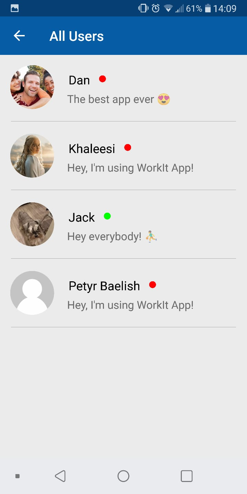

# WorkitChat

Chat Mobile App for Android.
Uses Firebase Platform for Authentication, Real-Time Database, Storage and Notifications.
Supporting Android 23+ API.

  

<h2>Main Capabilities:</h2>
<ul>
<li>Register\Log in - Authentication through Firebase Email and Password</li>
<li>Change profile image and status - Pick an image and crop it, a thumbnail image creates automatically aswell</li>
<li>Watch all app users</li>

  
  
   

<li>Send and Receive Friend Requests</li>
<li>One-on-One Live Chat - send messages and images, scroll up for older messages</li>
<li>Pick an Image and Crop it</li>

  
   
   

<li>Open image full screen with Zoom feature</li>
<li>Watch all your current chats</li>
<li>Get Notifications about a new message and new friend reuests you have receieved - 
click on the notification will send you to the main activity</li>

  
  
  

</ul>
